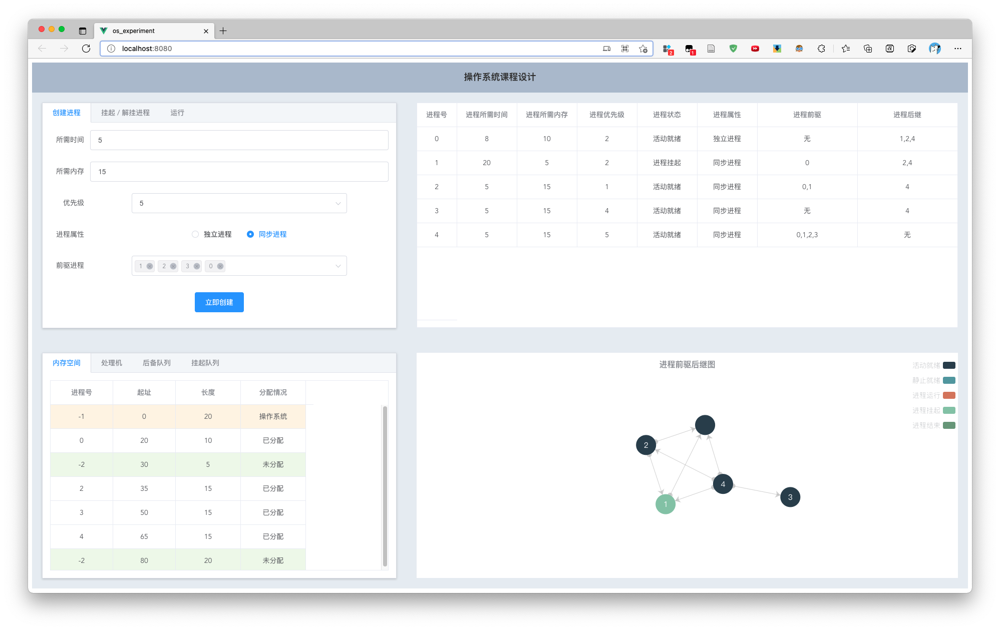
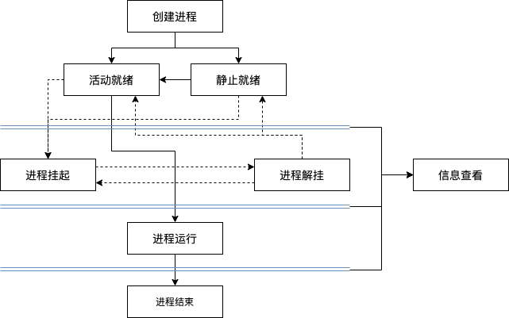
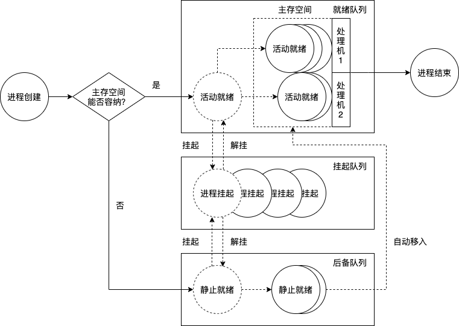
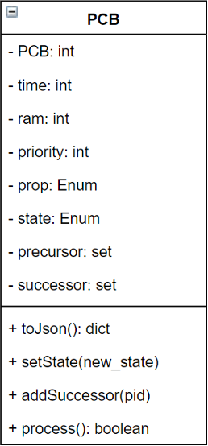
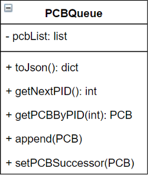
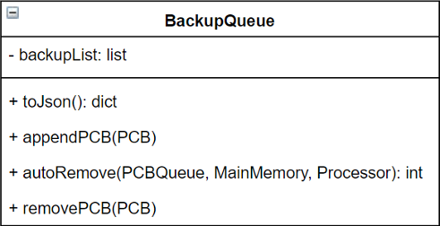
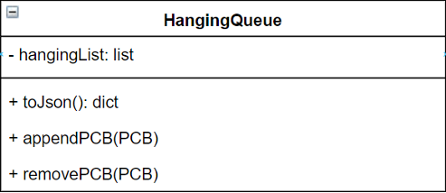
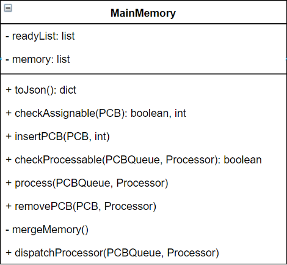

# 操作系统课程设计——处理机和进程调度算法及内存分配回收机制



多道程序系统中，进程与进程之间存在同步与互斥关系。当就绪进程数大于处理机数时，需按照某种策略决定哪些进程先占用处理机。在可变分区管理方式下，采用首次适应算法实现主存空间的分配和回收。

本程序模拟实现处理机调度和内存分配及回收机制，并通过可视化界面观察进程的运行流程与情况。为了实现算法与界面的解耦合，以及绘制更加优美的界面，本实验设计了前后端分离的架构，在后端使用Python的Flask框架实现相关算法并设计通信接口，在前端使用Vue.js框架及Element UI实现可视化界面，前后端通过Axios框架进行通信。

**本仓库为后端实现代码，前端可视化实现请前往仓库[操作系统课程设计Vue前端](https://github.com/lxysl/os_experiment_vue)**

---

- [操作系统课程设计——处理机和进程调度算法及内存分配回收机制](#操作系统课程设计处理机和进程调度算法及内存分配回收机制)
  - [起步](#起步)
    - [1. clone前端仓库](#1-clone前端仓库)
    - [2. 安装环境](#2-安装环境)
    - [3. 启动后端程序](#3-启动后端程序)
    - [4. 启动前端程序](#4-启动前端程序)
    - [5. 打开页面 http://localhost:8080/](#5-打开页面-httplocalhost8080)
  - [功能](#功能)
  - [结构](#结构)
  - [进程调度流程](#进程调度流程)
      - [1. 进程创建](#1-进程创建)
      - [2. 进程挂起](#2-进程挂起)
      - [3. 进程解挂](#3-进程解挂)
      - [4. 进程运行](#4-进程运行)
      - [5. 进程结束](#5-进程结束)
  - [内存调度算法——内存空间首次适应分配](#内存调度算法内存空间首次适应分配)
      - [1. 检查是否可分配内存空间](#1-检查是否可分配内存空间)
      - [2. 分配内存空间](#2-分配内存空间)
      - [3. 从主存空间中移除进程](#3-从主存空间中移除进程)
      - [4. 合并未分配内存空间](#4-合并未分配内存空间)
      - [5. 检查是否有可运行进程](#5-检查是否有可运行进程)
  - [处理机调度算法](#处理机调度算法)
      - [1. 处理进程运行](#1-处理进程运行)
      - [2. 从处理机中移除进程](#2-从处理机中移除进程)
      - [3. 为进程分配处理机](#3-为进程分配处理机)
  - [类设计](#类设计)
      - [1. PCB类](#1-pcb类)
      - [2. PCBQueue类](#2-pcbqueue类)
      - [3. BackupQueue类](#3-backupqueue类)
      - [4. HangingQueue类](#4-hangingqueue类)
      - [5. MainMemory类](#5-mainmemory类)
      - [6. Processor类](#6-processor类)

## 起步

### 1. clone前端仓库
```bash
git clone https://github.com/lxysl/os_experiment_vue
```

### 2. 安装环境
```bash
pip install flask
pip install flask_cors
```

### 3. 启动后端程序
```bash
cd <PREFIX_PATH>/OS_experiment
python app.py
```

### 4. 启动前端程序
```bash
cd <PREFIX_PATH>/os_experiment_vue
npm install
npm run serve
```

### 5. 打开页面 http://localhost:8080/

## 功能

为了实现对处理机调度算法和内存分配回收算法的模拟，本程序允许用户进行如下操作：创建进程、挂起/解挂进程、运行进程、刷新。

此外，用户可以通过前端界面实时查看每个操作带来的效果：全部进程信息表、内存分区表、处理机中的进程队列、后备队列、挂起队列、进程的前驱后继图。

## 结构



本程序为进程设计了六种状态模型：共有<CREATE: 0>、<ACTIVE_READY: 1>、<STATIC_READY: 2>、<RUNNING: 3>、<SUSPENDING: 4>、<EXIT: 5>六种状态；两种属性：< INDEPENDENT: 0>、< SYNCHRONIZED: 1>。

程序为处于活动就绪状态、挂起状态和静止就绪状态的进程分别设置了就绪队列、挂起队列和后备队列，按先进先出的顺序存储进程的进程号。

另外设置一个进程队列存储**所有**的进程对象，以便根据进程号获取进程对象。



## 进程调度流程

#### 1. 进程创建

* **【输入】** 进程的运行时间，所需内存空间，优先权，状态，属性（，前驱）

* **【限制】** 进程所需内存空间不能超过总内存空间减去操作系统所需的内存空间

* 对全部进程队列末尾的进程号+1获取新进程的进程号，设置状态为进程创建，初始化进程PCB并加入全部进程队列的队尾

* 为之前的所有进程设置后继进程

* 检查可分配内存空间，决定进程进入后备队列或就绪队列

* 如果可分配内存空间足够，按首次适应算法将进程插入内存（就绪队列），并为就绪队列中的所有进程分配处理机

* 如果可分配内存空间不足，将进程加入到后备队列的队尾

#### 2. 进程挂起

* 对处于活动就绪（内存中）的进程，从处理机的进程队列中移出进程，释放内存空间，合并未分配的内存空间，为就绪队列中的所有进程重新分配处理机

* 对于处于静止就绪（后备队列中）状态的进程，从后备队列中移出进程

* 加入到挂起队列的队尾

* 改变程序状态为静止就绪

#### 3. 进程解挂

* 从挂起队列中移除进程

* 检查可分配内存空间，决定进程进入后备队列或就绪队列

* 如果可分配内存空间足够，按首次适应算法将进程插入内存（就绪队列），并为就绪队列中的所有进程分配处理机

* 如果可分配内存空间不足，将进程加入到后备队列的队尾

#### 4. 进程运行

* 检查主存空间和处理机上是否有可运行程序

* 运行所有处理机上的第一个进程

* 根据可分配主存空间的大小，自动将后备队列中的进程移入主存，同时重新为就绪队列中的所有进程分配处理机

#### 5. 进程结束

* 进程运行后，若所需时间为0，则设置状态为进程结束

## 内存调度算法——内存空间首次适应分配

程序中管理内存空间的类包含两个属性：就绪队列和内存分区表。

就绪队列中存储所有处于内存空间中的进程号，内存分区表中以[PID, 起址, 长度, 状态]的形式存储内存块，并按起始地址进行升序排序。

内存分区表中对应存储的PID，OS对应的内存表项用-1表示，未分配内存表项用-2表示；状态有<UNASSIGNED: 0>、<ASSIGNED: 1>、<OS_ASSIGNED: 2>三种。

#### 1. 检查是否可分配内存空间

对于给定的进程，从内存分区表中依次查找，如果找到一块未分配内存并且该内存块的大小大于等于进程所需的内存，就返回对应内存块的序号，否则返回-1。

#### 2. 分配内存空间

* 首先检查是否可分配内存空间，获取可分配内存块的序号

* 如果该块内存与进程所需内存的大小恰好相等，直接将该块内存的进程号改为该进程的进程号，状态设置为已分配

* 如果该块内存小于进程所需内存的大小，则在其后面插入一个未分区内存块，新内存块的起始地址为上一内存的起始地址加上进程所需内存大小，大小为上一内存的大小减去进程所需内存大小。将上一内存块的进程号、内存块大小和状态改为该进程的进程号、内存大小和已分配

#### 3. 从主存空间中移除进程

* 首先从处理机中移除进程

* 遍历内存分区表，找到进程对应存储的内存块的序号

* 将该内存块的进程号设置为-2，状态设置为未分配

* 从就绪队列中移除进程号

* 合并未分配内存空间

#### 4. 合并未分配内存空间

* 遍历内存分区表，找到第一块未分配的内存空间

* 继续遍历，将紧邻的后续未分配内存空间加入要合并的内存列表，直到下一块内存空间是已分配的

* 对于要合并的内存列表，从内存空间中依次倒序弹出（避免弹出时超过列表的最大索引），将弹出内存块的大小加入找到的第一块未分配的内存空间中

#### 5. 检查是否有可运行进程

## 处理机调度算法

程序中的处理机类包含两个属性：处理机个数和处理机上的进程号列表。

处理机的个数通过配置文件进行设置，处理机上的进程号列表初始化为与处理机个数相同的空列表。

处理机类与主存空间类绑定，其中的方法只能通过主存空间对象进行调用，相当于主存空间的内部类。

#### 1. 处理进程运行

* 对所有处理机进行遍历，获取每个处理机上的第一个进程

* 对于该进程，判断其是否为独立进程、前驱进程全部完成的同步进程、前驱进程不是刚在本次运行的不同处理机中结束的同步进程这三种情况之一

* 对于b中的判断结果为是的进程，运行时间减少一个单位（模拟进程运行）

* 对于b中的判断结果为否的进程，不做操作，进入下一循环

* 如果该进程运行后恰好结束，则将其从处理机中移除，并加入本轮结束的进程列表，供b中的判断使用

#### 2. 从处理机中移除进程

* 在处理机进程列表中查找该进程，如果找到，移除该位置的进程

#### 3. 为进程分配处理机

* 在主存空间类中构建两个字典，一个存储独立进程以及前驱已经完成的同步进程，另一个存储同步进程

* 遍历就绪队列，为每个进程设置状态为活动就绪，并根据进程属性加入到a中设置的两个字典中

* 分别对两个字典按进程优先权降序排列

* 将两个字典按先独立后同步的顺序合并为一个列表

* 循环为每个处理机分配进程

## 类设计

#### 1. PCB类

保存进程的状态信息，可以设置进程状态，添加后继进程，运行进程。



#### 2. PCBQueue类

保存所有的进程对象，可以获取新增进程的进程号，通过进程PID获取进程对象，添加新进程，设置某一进程的后继进程。



#### 3. BackupQueue类

后备队列，可以添加进程，有可分配内存空间时自动移出PCB，手动移出PCB



#### 4. HangingQueue类

挂起队列，可以添加和移出进程



#### 5. MainMemory类

主存空间类，可以检查是否可分配空间，插入进程，检查是否有可运行进程，运行进程，移除进程，合并主存空间，为处理机分配进程。



#### 6. Processor类

处理机类，可以运行进程，移除进程，为处理机分配进程，其中的方法只能被MainMemory类对象调用，相当于其内部类。


